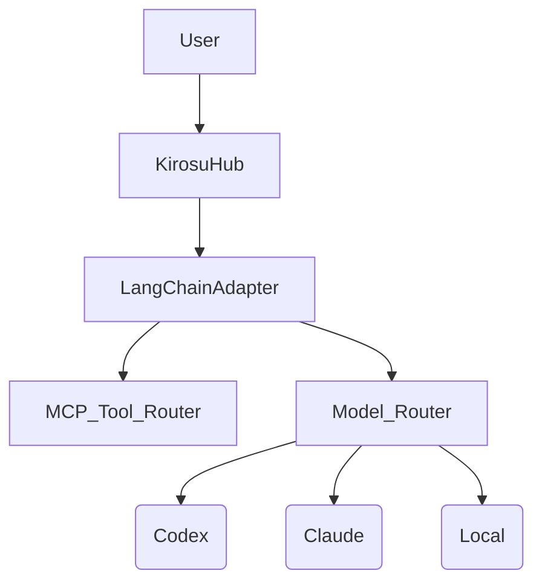

# Kirosu Provider & Architecture Guide

Tämä dokumentti on syvällinen katsaus tuettuihin LLM-järjestelmiin, niiden "pimeisiin" CLI-lippuihin, kontitus-strategioihin ja integroitavuuteen.

---

## 1. Kiro-CLI (Anthropic Wrapper)

Kirosun ensisijainen "headless" agentti-ajuri.

### 🕵️‍♂️ Konepellin Alla
*   **Arkkitehtuuri**: Rust-pohjainen CLI.
*   **Tietokanta**: SQLite. Tallentaa keskusteluhistorian ja MCP-konfiguraation.
    *   **macOS**: `~/Library/Application Support/kiro-cli/`
    *   **Linux**: `~/.config/kiro-cli/` tai `$XDG_CONFIG_HOME`
*   **Auth**: Tallennetaan samaan polkuun (tai Keychainiin käyttöjärjestelmästä riippuen).

### 🐳 Kontitus-strategia (Docker)
Koska tila on SQLite-tiedostossa, kontissa on kaksi haastetta: **Auth** ja **Persistenssi**.

**Ratkaisu:** Volume Mount.
```yaml
# docker-compose.yml
services:
  kirosu-agent:
    image: kirosu-agent
    volumes:
      # Mounttaa lokaalit credentialit ja tietokanta konttiin
      - ${HOME}/Library/Application Support/kiro-cli:/root/.config/kiro-cli
    environment:
      - ANTHROPIC_API_KEY=${ANTHROPIC_API_KEY}
```

### 🧠 MCP (Model Context Protocol) & Agentit
Kiro-CLI:n "taika" on `--agent` -lippu. Se lataa tietyn profiilin (system prompt + työkalut).

*   **Globaali MCP**: `~/.config/kiro-cli/mcp.json` (Kaikki agentit näkevät nämä).
*   **Local MCP**: `.kiro/mcp.json` (Projektikohtainen).

**Headless-ajo tietyllä agentilla:**
```bash
kiro-cli chat --no-interactive --agent "koodari-pro" "Refaktoroi tämä tiedosto"
```

---

## 2. Codex CLI (OpenAI Wrapper)

OpenAI:n virallinen, erittäin tehokas CLI. Tukee myös avoimen lähdekoodin malleja (`--oss`).

### 🕵️‍♂️ Konepellin Alla
*   **Config & Auth**: `~/.codex/config.toml` ja `~/.codex/session.json` (token).
*   **Headless Mode**: `codex exec` on eri komento kuin `codex` (TUI).

### 🏴‍☠️ "Hackers' Flags" (Dokumentoimattomat/Harvinaiset)

| Flagi | Selitys | Käyttö |
|-------|---------|--------|
| `--oss` | **Local Mode**. Ohjaa pyynnöt lokaaliin serveriin. | `codex exec --oss "Moi"` |
| `--local-provider` | Valitse `ollama` tai `lmstudio`. | `--local-provider ollama` |
| `--dangerously-bypass...`| Poistaa KAIKKI turvavahvistukset. | CI/CD-putket, Kirosu Agentit |
| `--json` | Puhdas JSONL-tuloste (ei värejä/spinneriä). | Ohjelmallinen parsinta |
| `--output-last-message` | Kirjoittaa vain vastauksen tiedostoon. | `> output.txt` korvike |

### 🐳 Kontitus
Codex vaatii session tokenin.
1. Kirjaudu host-koneella: `codex login`
2. Mounttaa config konttiin:
```yaml
    volumes:
      - ${HOME}/.codex:/root/.codex
```

---

## 3. Claude CLI / GLM (Anthropic)

Jos sinulla on konffattu `claude` (tai GLM4.6), se on usein suoraviivaisempi kuin Kiro-CLI, mutta vähemmän "agenttimainen" (vähemmän tilanhallintaa).

*   **Yhteensopivuus**: Claude CLI tukee nyt myös MCP:tä (`mcp.json`).
*   **API**: Jos käytät suoraan API:a (`curl`), menetät MCP-työkalutuen, ellet rakenna sitä itse (kuten LangChain tekee).

---

## 4. Kimi (Moonshot AI) 🇨🇳

Kiinalainen "pitkän kontekstin kuningas" (200k+ tokenia).

*   **Yhteensopivuus**: Täysin **OpenAI-yhteensopiva API**.
*   **Integraatio**:
    *   Vaihda `base_url`: `https://api.moonshot.cn/v1`
    *   Kirosussa: Käytä geneeristä `OpenAIProvider`:ia ja vaihda URL.

```python
client = OpenAI(
    api_key="MOONSHOT_KEY",
    base_url="https://api.moonshot.cn/v1"
)
```

---

## 5. Gemini 3 (Google) ⚡️

Käytät "Nightly" -versiota (`gemini-exp-1206` tai vastaava).

*   **Flash-malli**: Gemini 2.0 Flash on tulossa/beta. Se on *erittäin* nopea ja halpa.
*   **Vision**: Gemini on ylivoimainen monimodalisuudessa (video/kuva sisään).
*   **Swarm-käyttö**:
    *   Kirosu voisi käyttää Geminiä **Vision-silmänä**.
    *   Agentti A (Codex) pyytää Agenttia B (Gemini): "Katso tätä kuvakaappausta ja kerro onko testi läpi."

---

## 6. LangChain & MCP (The Glue)

LangChain on "yleisavain". Sen sijaan että koodaamme jokaisen providerin erikseen (`CodexProvider`, `KiroProvider`), voimme käyttää LangChainia abstraktiokerroksena.

### MCP LangChainissa
LangChainilla on `langchain-mcp` paketti.
*   Se osaa kytkeä MCP-serverin (esim. `sqlite-mcp`) suoraan LLM:n Tools-rajapintaan.
*   Tämä toimii **kaikilla** malleilla, jotka tukevat tool callingia (OpenAI, Anthropic, Mistral, Gemini).

**Arkkitehtuuri-idea:**


## Yhteenveto

1.  **Codex**: Paras "Swiss Army Knife" (OSS-tuki, CLI).
2.  **Kiro-CLI**: Paras Agentti-kokemus (valmiit MCP-profiilit).
3.  **Docker**: Vaatii `volumes`-kikkailua auth-tokenien kanssa (`~/.codex`, `Application Support`).
4.  **Tulevaisuus**: Gemini 3 Flash nopeuteen, Kimi massiiviseen kontekstiin (koko kirja kerralla).
