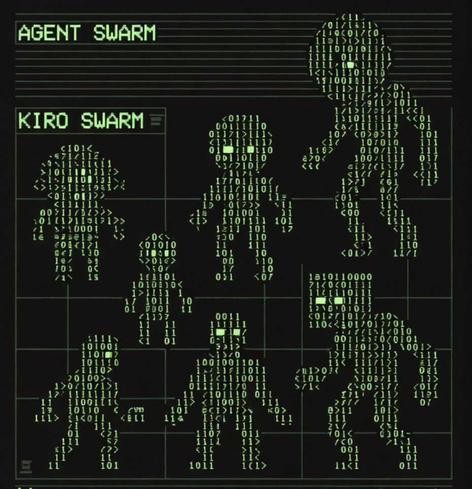

#  Kirosu

**Enterprise-grade AI Agent Swarm Orchestrator.**

Kirosu (formerly `kiro-swarm`) is a production-ready platform for orchestrating swarms of AI agents. It bridges the gap between simple chat interfaces and complex, autonomous agent workflows. Kirosu features a centralized Hub for task management, distributed Agents for execution, and an Adapter Pattern for pluggable LLM backends (Codex, Standard CLI).

## 📚 Documentation Index

- **[Technology Architecture](technology.md)**: Deep dive into the Hub-Spoke design, protocols (JSON-RPC), and Docker internals.
- **[Use Cases](use_cases.md)**: Enterprise scenarios like "Massive Data Processing", "Automated Code Review", and "Feature Swarms".
- **[Go Support](go/README.md)**: Protocol documentation for Go workers.
- **[User Stories](user_stories.md)**: Original requirements and validation flows.

## ✨ Key Features

### 🏢 Architecture
- **Hub-Spoke Design**: Centralized SQLite-backed task queue with distributed, stateless workers.
- **Persistent Connections**: TCP-based communication with automatic reconnection and retry logic.
- **Docker Ready**: Full `docker-compose` support for instant deployment.

## 🐍 Philosophy: Why Python & SQLite?

**We built Kirosu to move fast.**

Could we have written this in Go or Rust? **Yes.**
Would it serve 100k requests/second? **Maybe.**
Would it have taken 6 months to build the first demo? **Definitely.**

Kirosu's architecture (Python 3.10 + SQLite WAL) is a deliberate choice:
1.  **Code is the Interface**: You don't configure Kirosu with YAML; you script it with Python. This gives you the full power of the ecosystem (`pandas`, `numpy`, `requests`) inside your orchestration logic.
2.  **Zero-Latency Handoff**: Because the logic is Python, passing objects between "Planner" and "Executor" is trivial.
3.  **Simplicity scales**: You can run 50 agents on a MacBook Air. That's enough for 99% of real-world use cases.
4.  **"Don't optimize early"**: When you actually hit the limits of Python (e.g. HFT), you use the **Internal Loop Pattern** (see `technology.md`) to bypass the bottleneck, rather than rewriting the whole OS.

### 🧠 Intelligence & Strategy
- **Strategy Suggestion**: `kirosu suggest "task description"` analyzes your goal and recommends the best agent topology (Sequential, Parallel, Recursive).
- **Recursive Planning**: `kirosu run-recursive` spawns a "Planner Agent" that breaks down complex goals into a YAML pipeline, which is then executed by the swarm.
- **Multi-Provider Support**: Switch seamlessly between backends via `KIRO_PROVIDER`.
  - **Codex**: Frontier model automation (`gpt-5.1-codex-mini`).
  - **Kiro CLI**: Standard local/remote execution.

### 🛡️ Enterprise Grade
- **Human-in-the-Loop (HITL)**: Sensitive tasks pause for `kirosu approve` before execution.
- **Security**: Token-based authentication (`KIRO_SWARM_KEY`) and explicit "Dangerous Mode" opt-in.
- **Observability**: Real-time TUI Dashboard (`kirosu dashboard`) and JSON metrics endpoint.

## 🚀 Quick Start (Docker)

The fastest way to run a full swarm (Hub + 3 Agents).

```bash
# Start Hub and 3 Codex Agents
docker-compose up --scale agent=3
```

## 🚀 Quick Start (Local)

1.  **Install**:
    ```bash
    pip install .
    ```

2.  **Start Hub**:
    ```bash
    kirosu hub
    ```

3.  **Start Agent** (in a new terminal):
    ```bash
    # Standard Agent
    kirosu agent
    
    # Codex Agent (High Speed)
    export KIRO_PROVIDER=codex
    kirosu agent --model gpt-5.1-codex-mini
    ```

4.  **Submit a Task**:
    ```bash
    kirosu task add "Analyze the server logs"
    ```

## 🔧 Configuration

Configuration is merged from `~/.kirosu/config.toml` (global) and `.kiro/config.toml` (local).

| Env Variable | Description | Default |
|--------------|-------------|---------|
| `KIRO_PROVIDER` | LLM Backend (`kiro`, `codex`) | `kiro` |
| `MITTELO_KIRO_MODEL` | Model ID used by agents | `claude-haiku-4.5` |
| `KIRO_SWARM_KEY` | Authentication Token | `None` (Dev) |

## 🧪 Development & Testing

Kirosu includes a robust test suite.

```bash
# Run Unit & Integration Tests
uv run pytest

# Run Codex Feature Tests (Mocked)
uv run pytest tests/test_codex_features.py
```

## 📂 Project Structure
- `kirosu/`: Core package.
    - `hub.py`: Central Orchestrator.
    - `agent.py`: Worker logic.
    - `strategy.py`: Planning & Analysis interactions.
    - `providers.py`: LLM Adapter Layer.
- `examples/`: Ready-to-run demos (`codex_swarm_demo.py`, `massive_data.py`).

