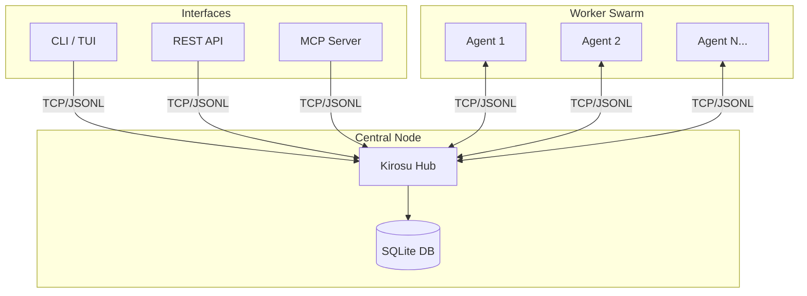
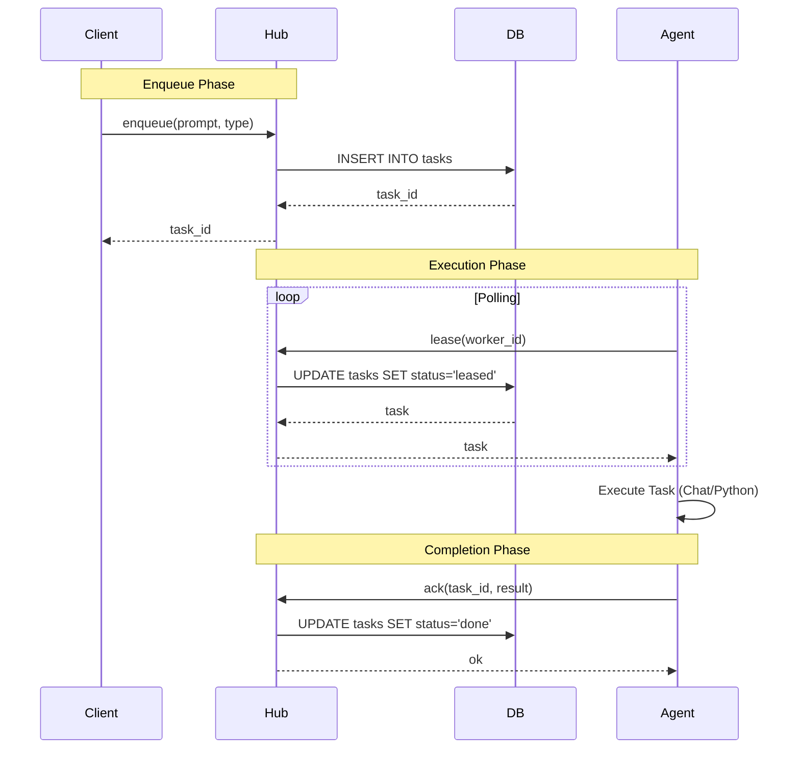
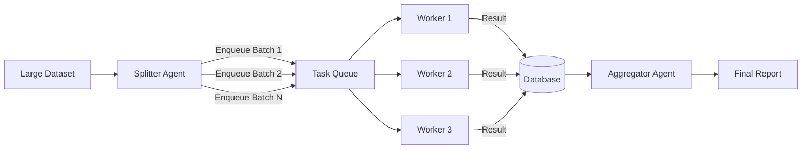

# Kirosu Technology & Architecture

This document details the technical architecture, protocols, and design patterns used in Kirosu.

## 🏗️ System Architecture

Kirosu follows a **Hub-Spoke** architecture where a central Hub manages state and distributed Agents perform work.

## 🛠️ Technology Stack

| Component | Technology | Purpose |
|-----------|------------|---------|
| **Language** | Python 3.10+ | Core logic, extensive library ecosystem. |
| **Database** | SQLite | Zero-conf, file-based persistence, concurrent access via WAL. |
| **Protocol** | JSON-RPC (JSONL) | Lightweight, language-agnostic communication over TCP. |
| **Dashboard** | Textual / Rich | Modern TUI for real-time monitoring in the terminal. |
| **API** | FastAPI / Uvicorn | High-performance REST interface. |
| **Integration** | MCP (Model Context Protocol) | Standardized tool exposure to AI assistants. |
| **Packaging** | Hatchling / PyPI | Standard Python packaging and distribution. |

## 🔄 Task Lifecycle

The core of Kirosu is the task lifecycle, managed via the `lease` and `ack` protocol.

## 🧩 Key Techniques

### 1. Persistent Connections
Agents maintain a persistent TCP connection to the Hub. This reduces handshake overhead and allows for potential future features like server-sent events (push notifications).
- **Implementation**: `kirosu.agent.PersistentHubClient`
- **Resilience**: Automatic reconnection with exponential backoff.

### 2. Dangerous Execution ("God Mode")
Kirosu supports a `type="python"` task which executes arbitrary code on the agent's host.
- **Risk**: High. Full access to file system and network.
- **Mitigation**: Explicit opt-in via `trust-all-tools` and `KIRO_SWARM_KEY` for auth.
- **Use Case**: Bug fixing, file system manipulation, complex calculations.

### 3. LLM Provider Adapter
Kirosu uses an Adapter Pattern (`kirosu/providers.py`) to interface with different LLM CLIs.

- **KiroCliProvider**: wrapper for `kiro-cli` (Standard).
- **CodexProvider**: wrapper for `codex` (Frontier models).
  - Supports `--dangerously-bypass-approvals-and-sandbox` for high-throughput automation.
  - Activated via `KIRO_PROVIDER=codex`.

## 4. Workdir Strategies
The `workdir` config determines how agents share state:
- **Shared Workspace**: Agents share a directory (e.g., repo root). Useful for read-only analysis or when file locking is managed externally.
- **Isolated Workspace**: Agents work in private directories (e.g., `/tmp/agent_1`). Essential for "Dangerous" execution to prevent side effects.
- **Context Injection**: The `.kiro/context.md` file is resolved relative to the agent's `workdir`.

### 5. Swarm Patterns: Map-Reduce
For massive data processing, we use a Splitter-Aggregator pattern.

## 🔐 Security

- **Authentication**: Token-based (`KIRO_SWARM_KEY`) for all Hub interactions.
- **Network**: Binds to `127.0.0.1` by default. Can be exposed via SSH tunnels or VPNs for distributed swarms.
